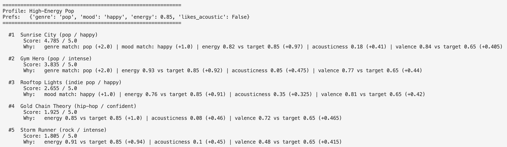
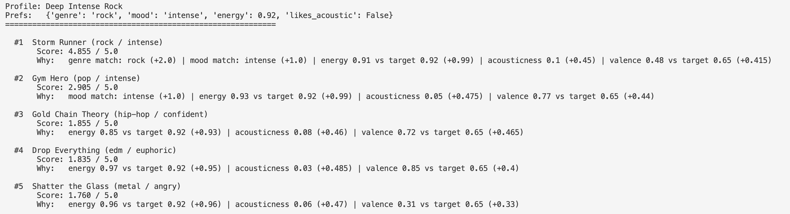
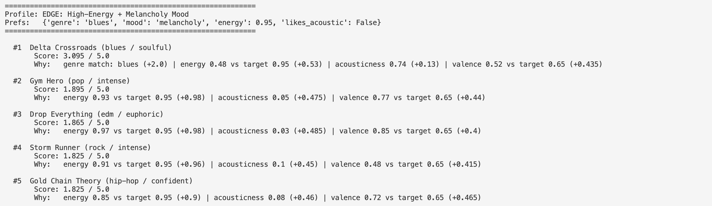

# 🎵 Music Recommender Simulation

## Project Summary

In this project you will build and explain a small music recommender system.

Your goal is to:

- Represent songs and a user "taste profile" as data
- Design a scoring rule that turns that data into recommendations
- Evaluate what your system gets right and wrong
- Reflect on how this mirrors real world AI recommenders

Replace this paragraph with your own summary of what your version does.

---

## How The System Works

Explain your design in plain language.

Some prompts to answer:

- What features does each `Song` use in your system
  - For example: genre, mood, energy, tempo
- What information does your `UserProfile` store
- How does your `Recommender` compute a score for each song
- How do you choose which songs to recommend

You can include a simple diagram or bullet list if helpful.

---

## Getting Started

### Setup

1. Create a virtual environment (optional but recommended):

   ```bash
   python -m venv .venv
   source .venv/bin/activate      # Mac or Linux
   .venv\Scripts\activate         # Windows

2. Install dependencies

```bash
pip install -r requirements.txt
```

3. Run the app:

```bash
python -m src.main
```

### Running Tests

Run the starter tests with:

```bash
pytest
```

You can add more tests in `tests/test_recommender.py`.

---

## Experiments You Tried

Three user profiles were run through the recommender — two standard and one adversarial edge case.

### Profile 1 — High-Energy Pop

**Observation:** Genre match is decisive, both pop songs occupy #1 and #2 despite Gym Hero missing the mood. Rooftop Lights earns #3 on mood match alone (indie pop ≠ pop, so no genre points).

---

### Profile 2 — Deep Intense Rock

**Observation:** Storm Runner is a near-perfect match (4.855). The gap between #1 and #2 (nearly 2 points) shows how powerful the genre+mood double-match is. Metal's Shatter the Glass ranks #5 despite near-identical energy, no categorical match drags it down.

---

### Profile 3 — EDGE: High-Energy + Melancholy Mood (conflicting preferences)


**Observation:** The system is "tricked" by the conflict. Delta Crossroads wins on genre match (+2.0) even though its energy (0.48) is far from the target (0.95). Energy and mood never align simultaneously in the catalog, the system has no song that is both blues AND high-energy, so it falls back to genre as the tiebreaker. This exposes genre matching as a limitation.

---

## Limitations and Risks

Summarize some limitations of your recommender.

Examples:

- It only works on a tiny catalog
- It does not understand lyrics or language
- It might over favor one genre or mood

You will go deeper on this in your model card.

---

## Reflection

Read and complete `model_card.md`:

[**Model Card**](model_card.md)

Write 1 to 2 paragraphs here about what you learned:

- about how recommenders turn data into predictions
- about where bias or unfairness could show up in systems like this
