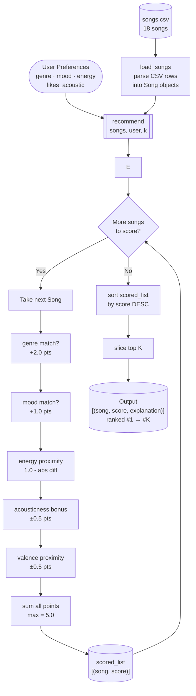

# Music Recommender — Data Flow Diagram

Visualize this diagram at [mermaid.live](https://mermaid.live) by pasting the code block below.

## Data Flow Summary

| Stage | What happens |
|---|---|
| **Input** | User preferences + songs.csv loaded into Song objects |
| **Process** | Every song scored against 5 rules (max 5.0 pts each) |
| **Output** | Sorted list sliced to top-K recommendations |

## Scoring Rules

| Rule | Max Points |
|---|---|
| Genre match | +2.0 |
| Mood match | +1.0 |
| Energy proximity `1.0 - abs(song.energy - target)` | +1.0 |
| Acousticness bonus `0.5 * acousticness (or inverse)` | +0.5 |
| Valence proximity `0.5 * (1.0 - abs(song.valence - 0.65))` | +0.5 |
| **Total** | **5.0** |
